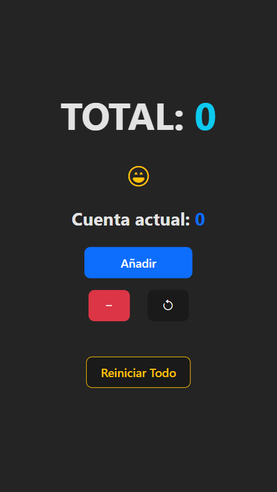

# Personal Project for Testing the `useEffect` Hook and Local Storage in React

## Project Description

This is a personal project created for testing the `useEffect` hook and local storage functionality in React. The project aims to explore how data can be stored and retrieved from local storage using React's state management and the `useEffect` hook.

## Features

- Increment and decrement counters
- Store counter values in local storage
- Reset counters individually or all at once

## Screenshot

## Technologies Used

- React
- JavaScript
- HTML
- CSS
- Bootstrap

## Note
This project is for educational and testing purposes only and may not have full production-level functionality or design. It is intended for learning and experimentation.

Please keep in mind the following:

- This project focuses on local storage functionality using the `useEffect` hook and `localStorage` in React and may not address other aspects such as performance, security, etc.
- Be aware that local storage is limited to the browser in which the application is running and may not persist across different devices or sessions.
- Remember that data stored in the browser's local storage may be accessible to the user, so it is not recommended to store sensitive or confidential information.

